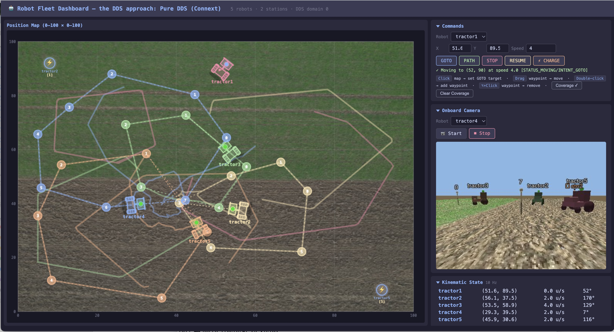

# Tractor Fleet: Middleware Technology Comparison

An autonomous tractor fleet scenario built three ways — **pure gRPC**,
**hybrid gRPC + DDS**, and **pure DDS** — to evaluate the technology trade-offs
with running code.

| Approach | Directory | Control Plane | Data Plane | Discovery |
|----------|-----------|---------------|------------|-----------|
| **gRPC** | [`grpc/`](grpc/) | gRPC unary RPC | gRPC server-streaming | Zeroconf mDNS |
| **Hybrid** | [`grpc-dds/`](grpc-dds/) | gRPC unary RPC | DDS pub-sub | SPDP + Zeroconf |
| **DDS** | [`dds/`](dds/) | DDS request-reply | DDS pub-sub | SPDP only |

## The Scenario

A fleet of autonomous tractors works a field while coordinating with
charging stations and a fleet management console:



- **Multiple tractors** (default 5) — each tractor is an autonomous process that:
  - **Produces:** `KinematicState` (position + velocity), `OperationalState`,
    `Intent`, `Telemetry`, `LiveVideo`, and coverage trail
  - **Consumes:** `KinematicState`, `OperationalState`, and `Intent` from
    every other tractor
  - **Telemetry** includes CPU, memory, motor temperature, and signal
    strength / link quality (relevant to mixed WiFi/5G/radio connectivity)
  - Exposes a **command service** interface
- **Multiple charging stations** (default 2) — each station is an autonomous
  process that manages charge-slot queuing and reservation via request-reply
- **Multiple fleet UIs** (default 1) — visualize all tractors, send commands,
  and view live video

Defaults can be modified by editing the `shared/fleet_common.sh` file.

### Data-Flow Requirements

| Data Flow | Send Policy | Reliability | Notes |
|-----------|------------|-------------|-------|
| `KinematicState` | Periodic (10 Hz) or on significant change | Best-effort | Consumers must know position within 1 m, velocity within 1 m/s |
| `OperationalState` | On change | Reliable | Latest state must be known by all |
| `Intent` | On change | Reliable | Latest intent must be known by all |
| `Telemetry` | Periodic | Best-effort | Loss of periodic samples is tolerable |
| `LiveVideo` | Streaming | Best-effort | On-demand from fleet UI |
| `CoveragePoint` | On move | Reliable | Trail history; persists across restarts (DDS approaches) |
| Commands | Request-reply | Reliable | Must be delivered |

### What Makes It Hard

- **Dynamic discovery** — agents come and go at runtime; IP addresses change
- **Late-joiner convergence** — new participants need current state immediately
- **Presence detection** — know within 100 ms if an agent is alive or dead
- **Mixed connectivity** — WiFi / 5G / radio with temporary disconnects
- **Per-flow QoS** — not all data flows are equally critical (see table above)
- **Scale** — must work for 5 tractors and for 100+

Each approach implements the exact same scenario with the same CLI, so you can
compare them directly.

## Quick Start

### Prerequisites

- Python 3.14.3+
- RTI Connext DDS 7.6+ ([install Connext DDS](https://community.rti.com/static/documentation/developers/get-started/)) (for `grpc-dds/` and `dds/` approaches)

### Setup

The setup script creates a virtual environment and installs dependencies.
It uses `python3` by default — if that does not point to Python 3.14.3+,
set the `PYTHON` variable:

```bash
# Clone the repo
git clone https://github.com/rticommunity/rticonnextdds-comparison-tractor-fleet.git
cd rticonnextdds-comparison-tractor-fleet

# If your default python3 is 3.14.3+:
source setup.sourceme grpc         # gRPC only
source setup.sourceme dds          # DDS only
source setup.sourceme grpc-dds     # hybrid
source setup.sourceme              # all (default)

# If python3 points to an older version, specify the interpreter:
PYTHON=python3.14 source setup.sourceme grpc
```

For approaches that use RTI Connext DDS, set `RTI_PYTHON_DIR` to point to your
Connext installation's Python API directory before sourcing:

```bash
export RTI_PYTHON_DIR=/path/to/rti_connext_dds-7.x.x/resource/python_api
source setup.sourceme dds
```

### Run a Demo

The CLI is **uniform** across all three approaches:

```bash
cd grpc/               # or grpc-dds/ or dds/
./demo_start.sh all      # launch stations + robots + UI
                       # open http://localhost:5000
./demo_stop.sh         # stop everything
```

Individual components:

```bash
./demo_start.sh stations           # all charging stations
./demo_start.sh robots             # all robots
./demo_start.sh ui                 # dashboard only
./demo_start.sh robot tractor1     # single robot
./demo_start.sh station station1   # single station
```

### gRPC: Generate Protobuf Stubs

The `grpc/` and `grpc-dds/` approaches require generated protobuf files.
Run once after cloning:

```bash
cd grpc/          # or grpc-dds/ or dds/
./types_generate.sh
```

### Type Support Generation

Each approach requires generated type support files. Run once after cloning
(or after changing type definitions):

```bash
cd grpc/          # or grpc-dds/ or dds/
./types_generate.sh
```

## Comparison Summary

| Dimension | gRPC | Hybrid | DDS |
|-----------|------|--------|-----|
| Pub-sub transport | gRPC streaming | DDS (native) | DDS (native) |
| Command transport | gRPC unary | gRPC unary | DDS-RPC |
| Discovery | Zeroconf | SPDP + Zeroconf | SPDP only |
| Connections (5 bots) | 25 channels, 105 streams | 7 DDS + 5 gRPC | 7 DDS + 1 requester |
| Coverage persistence | None (lost on restart) | Yes (DDS Persistent) | Yes (DDS Persistent) |
| Late-joiner state | Wait for next publish | Sub-second (DDS) | Sub-second (DDS) |
| Presence detection | Seconds (TCP timeout) | 100 ms (DDS liveliness) | 100 ms (DDS liveliness) |
| QoS per data flow | No | Yes (DDS topics) | Yes (DDS topics) |
| WiFi blip (2 sec) | Reconnection storm | Data OK, cmds reconnect | No disruption |
| Threads per robot | ~23 | ~8 | ~4 |

## Repository Structure

```
├── grpc/              Pure gRPC implementation
├── grpc-dds/          Hybrid: gRPC control + DDS data plane
├── dds/               Pure DDS implementation
├── shared/            Arena, video renderer, fleet config (shared by all)
├── requirements/      Layered Python dependency files
├── setup.sourceme     Environment setup script
├── LICENSE
└── README.md
```

Each approach directory contains its own `README.md` with architecture details,
data flow descriptions, and design documentation.

## Part of the RTI Technology Comparison Series

This repository is part of a series comparing middleware technologies for
real-world distributed systems scenarios. Each comparison uses the same
scenario to evaluate different technology stacks side by side.

| Scenario | Technologies | Repository |
|----------|-------------|------------|
| **Tractor Fleet** | gRPC, DDS | *this repo* |
| *more coming* | | |
